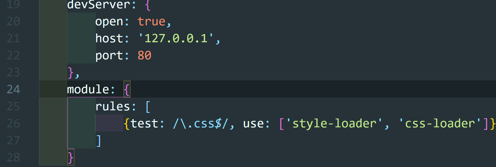
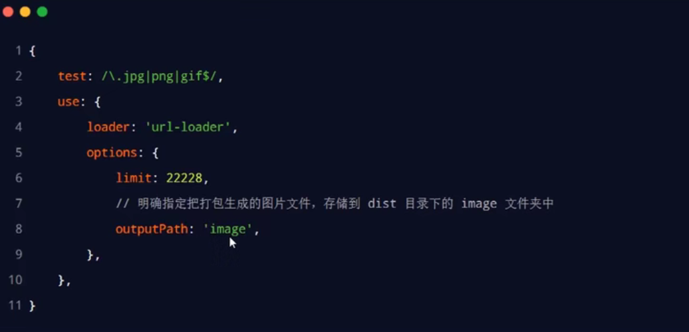

# Webpack

## webpack的基本使用

### 1. 创建列表隔行变色项目

1. 新建项目空白目录，并运行npm init -y 命令，初始化包管理配置文件package.json
2. 新建src源代码目录
3. 新建src->index.html首页和src->index.js脚本文件
4. 初始化首页基本的结构
5. 运行npm install jquery -S命令，安装jQuery
6. 通过ES6模块化的方式导入jQuery，实现列表隔行变色效果

uncaught SyntaxError：Cannot use import statement outside a module兼容性问题，使用webpack可以解决兼容性问题，ES6的语法在文件中是普遍存在问题的

### 2.在项目中安装webpack

在终端运行如下命令，安装webpack相关的两个包

```js
npm install webpack@5.5.1 webpack-cli@4.5.0 -D
```

### 3. 在项目中配置webpack

1. 在项目根目录中，创建名为webpack.config.js的webpack配置文件，并初始化如下的基本配置：

   

2. 在package.json的scripts节点下，新增dev脚本如下：

   

3. 在终端中执行npm run dev命令，启动webpack进行项目的打包构建

4. 在index.html中引用生成的dist/main.js

#### 3.1 mode的可选值

mode节点有两个可选值，分别是：

1. development
   - 开发环境
   - 不会对打包生成的文件进行代码压缩和性能优化
   - 打包速度快，适合在开发阶段使用
2. production
   - 生产环境
   - 会对打包生成的文件进行代码压缩和性能优化
   - 打包速度很慢，仅适合在项目发布阶段使用

#### 3.2 webpack.config.js文件的作用

webpack.config.js是webpack的配置文件。webpack在真正开始打包构建之前，会先读取这个配置文件，从而基于给定的配置，对项目进行打包

webpack是基于node.js开发，因此配置文件支持使用node.js相关语法和模块进行webpack的个性化配置

#### 3.3 webpack中的默认约定

在webpack中有如下**默认约定**：

1. 默认打包入口文件为：src -> index.js
2. 默认的输出文件路径为：dist -> index.js

#### 3.4 自定义打包的入口和出口

在webpack.config.js配置文件中，通过entry节点指定打包的入口，通过output节点指定打包的出口，示例如下：


## webpack中的插件

### 1. webpack插件的作用

通过安装和配置第三方的插件，可以拓展webpack的能力，从而让webpack用起来更方便。最常用的webpack插件有如下两个：

1. webpack-dev-server
   - 类似于node.js阶段用到的nodemon工具
   - 每当修改了源代码，webpack会自动进行项目的打包和构建
2. html-webpack-plugin
   - webpack中的HTML插件（类似于一个模板引擎插件）
   - 可以通过此插件自定制index.html页面的内容

### 2.webpack-dev-server

webpack-dev-server可以让webpack监听项目源代码的变化，从而进行自动打包构建。

#### 2.1 安装webpack-dev-server

运行如下命令，即可在项目中安装此插件：

```js
npm install webpack-dev-server@3.11.0 -D
```

#### 2.2 配置webpack-dev-server

1. 修改package.json -> scripts中的dev命令如下：

   

2. 在此执行npm run dev命令，重新进行项目的打包

3. 在浏览器中访问http://localhost:8080地址，查看自动打包效果

#### 2.3 打包生成的文件哪儿去了？

1. 不配置webpack-dev-server的情况下，webpack打包生成的文件，会存放到实际的物理磁盘上
   - 严格遵守开发者在webpack.config.js中指定配置
   - 根据output节点指定路径进行存放
2. 配置了webpack-dev-server之后，打包生成的文件存放到了内存中
   - 不在根据output节点指定的路径，存放到实际的物理磁盘上
   - 提高了实时打包输出的性能，因为内存比物理磁盘速度快很多

#### 2.4 生成到内存中的文件该如何访问？

webpack-dev-server生成到内存中的文件，默认放到了项目的根目录中，而且是虚拟的，不可见的。


### 3. html-webpack-plugin

html-webpack-plugin是webpack中的HTML插件，可以通过此插件自定制index.html页面的内容。

功能：通过html-webpack-plugin插件，将src目录下的index.html首页，复制到项目根目录中。

#### 3.1 安装html-webpack-plugin

运行如下的命令，即可在项目中安装此插件：

```js
npm install html-webpack-plugin@5.3.2 -D
```

#### 3.2 配置html-webpack-plugin


#### 3.3 解惑html-webpack-plugin

1. 通过HTML插件复制到项目根目录中的index.html页面，也被放到了内存中
2. HTML插件在生成的index.html页面的底部，自动注入了打包的bundle.js文件，在页面中F12可以看到
3. 开启实时打包时，根目录下dist/bundle.js可以直接删除，此时是在内存中显示

### 4. devServer节点

在webpack.config.js配置文件中，可以通过devServer节点对webpack-dev-server插件进行更多的配置，示例代码如下：

```json
devServer: {
    open: true, //打包完成后，自动打开浏览器
    host: '127.0.0.1', //实时打包所有的主机地址
    port: 80, //实时打包所使用的端口号
}
```


## webpack中的loader

### 1. loader概述

在实际开发过程中，webpack默认只能打包处理以.js后缀名结尾的模块。其他非.js后缀名结尾的模块，webpack默认处理不了，需要调用loader加载器才可以正常打包，否则会报错！

loader加载器的作用：协助webpack打包处理特定的文件模块。比如：

- css-loader：可以打包处理.css相关的文件
- less-loader：可以打包处理.less相关的文件
- babel-loader：可以打包处理webpack无法处理的高级JS语法

### 2.loader的调用过程


### 3. 打包处理css文件

1. 运行npm i style-loader@2.0.0 css-loader@5.0.1 -D命令，安装处理css文件的loader

2. 在webpack.config.js的module -> rules数组中，添加loader规则如下：

   

   其中，test表示匹配的文件类型，use表示对应要调用的loader。

   注意：

   - 其中style-loader和css-loader的顺序不能反
   - 多个loader的调用顺序是：从后往前调用，上面先调用css-loader，再调用style-loader



### 4. 打包处理less文件

1. 运行npm i less-loader@7.1.0 less@3.12.2 -D 命令

2. 在webpack.config.js的module -> rules数组中国，添加loader规则如下：

   

### 5.打包处理样式表中与url路径相关的文件


此时会报错，需要路径loader处理

1. 运行npm i url-loader@4.1.1 file-loader@6.2.0 -D 命令

2. 在webpack.config.js的module -> rules数组中，添加loader规则如下：

   


注意：

- ERROR in ./1.jpg 1:0 Module parse failed: Unexpected character '�' (1:0)报错可能是test中有空格，或者书写不正确。
- ?后是loader的参数项，limit=22229指图片小于或等于22229byte就转为base64格式，大于就不会转base64

#### 5.1 loader的另一种配置方式

带参数的loader还可以通过对象的方式进行配置


### 6. 打包处理js文件中的高级语法

webpack只能打包处理一部分高级的JavaScript语法。对于哪些webpack无法处理的高级JS语法，需要借助babel-loader进行打包处理。例如webpack无法处理下面的JS代码：


#### 6.1 安装babel-loader相关的包

运行如下得到命令安装对应的依赖包：

```js
npm i babel-loader@8.2.1 @babel/core@7.12.3 @babel/plugin-proposal-class-properties@7.12.1 -D
```

#### 6.2 配置babel-loader

在webpack.config.js的module -> rules 数组中，添加loader规则如下：


## 打包发布

### 1. 为什么要打包发布

项目开发完成之后，使用webpack对项目进行打包发布的主要原因有以下两点：

1. 在开发环境下，打包生成的文件存放于内存中，无法获取到最终打包生成的文件
2. 开发环境下，打包生成的文件不会进行代码压缩和性能优化

### 2. 配置webpack的打包发布

在package.json文件的scripts节点下，新增build命令如下：


--model是一个参数项，用来指定webpack的运行模式。production代表生成环境，会对打包生成的文件进行代码压缩和性能优化。

注意：通过 --model指定的参数项，会覆盖webpack.config.js中的model选项

### 3.把JavaScript文件统一生成到js目录中

在webpack.config.js配置文件的output节点中，进行如下的配置：


### 4. 把图片文件统一生成到image目录中

修改webpack.config.js中的url-loader配置项，新增outputPath选项即可指定图片文件的输出路径：



### 5. 自动清理dist目录下的旧文件

为了在每次发布时，**自动清理掉dist目录中的旧文件**，可以安装并配置clean-webpack-plugin插件：


### 6.企业级的项目在进行打包发布

企业级的项目在进行打包发布时，远比刚才的方式要复杂得多，主要的发布流程如下：

- 生成打包报告，根据报告分析具体的优化方案
- Tree-Shaking
- 为第三方库启用CDN加载
- 配置组件的按需加载
- 开启路由懒加载
- 自定制首页内容

## Source Map

### 1. 生产环境遇到的问题

前端项目在投入生产环境之前，都需要对JS源代码进行压缩混淆，从而减下文件的体积，提高文件的加载效率。此时就不可以避免的产生了另一个问题：

- 对压缩混淆之后的代码除错（debug）是一件及其困难的事情
- 变量被替换成没有任何语义的名称
- 空行和注释被删除

### 2. 什么是Source Map

Source Map是一个信息文件，里面储存这位置信息。即，Source Map文件中存储这代码压缩混淆前后的对应关系。

有了它，出错的时候，除错工具将直接显示原始代码，而不是转换后的代码，能够极大的方便后期的调试

### 3. webpack开发环境下的Source Map

在开发环境下，webpack默认启用了Source Map功能。当程序出错时，可以直接在控制台提示错误行的位置，并定位到具体的源代码


点击链接，可以直接定位到错误行


#### 3.1 默认Source Map的问题

开发环境下默认生成的Source Map，记录的是生成后的代码的位置。会导致运行时报错的行数与源代码的行数不一致的问题。示例如下图：


#### 3.2 解决默认Source Map的问题

开发环境下，推荐在webpack.config.js中添加如下的配置，即可保证运行时报错的行数与源代码的行数保持一致（仅限开发环境中使用）：


### 4. webpack生产环境下的Source Map

在生产环境中，如果省略了devtool选项，则最终生成的文件中不包含Source Map。真能够防止原始代码通过Source Map的形式暴露给别有所图的人。


#### 4.1 只定位行数不暴露源码

在生产环境下，如果指向定位报错的具体行数，且不想暴露源码。此时可以将devtool的值设置为nosources-source-map


#### 4.2 定位行数且暴露源码

在生产环境下，如果想在定位报错行数的同时，展示具体报错的源码。此时可以将devtool的值设置为source-map。实际效果如图所示：


采用此选项后：你应该将你的服务器配置为，不允许普通用户访问source map文件。

### 5. Source Map的最佳实践

1. 开发环境下：
   - 建议把devtool的值设置为eval-source-map
   - 好处：可以精准定位到具体的错误行
2. 生产环境下：
   - 建议关闭Source Map或将devtool的值设置为nosources-source-map
   - 好处：防止源码泄露，提高网站的安全性
